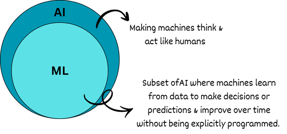

#  Artificial Intelligence (AI) 

> *“Teaching machines to think is not about replacing humans,  
but about extending human intelligence.”*

---

##  What is Artificial Intelligence?

Imagine a machine that can **think, learn, and solve problems** the way humans do.  
That idea is known as **Artificial Intelligence (AI)**.

**Artificial Intelligence** refers to the ability of a machine or software system to **mimic human intelligence**.

It is called **artificial** because this intelligence is **man-made**, unlike **natural intelligence**, which humans and animals are born with.

---

##  Natural Intelligence vs Artificial Intelligence

- **Natural Intelligence**
  - Found in humans and animals
  - Includes reasoning, learning, creativity, emotions, and common sense
  - Humans excel in science, arts, sports, and technology

- **Artificial Intelligence**
  - Created by humans using computers
  - Aims to imitate human thinking and decision-making
  - Has no emotions or consciousness

> **In simple words:**  
> When we try to make machines *as intelligent as humans*, we call it **Artificial Intelligence**.

---

##  Definition (Academic)

> **Artificial Intelligence** is a branch of computer science that focuses on developing machines or software capable of **thinking, learning, and making decisions** similar to human intelligence.

---

##  Real-World Applications of AI

AI is already a part of our everyday life:

- **Medical Imaging**  
  AI analyzes X-rays and MRI scans to detect diseases like cancer.

- **Virtual Assistants**  
  Google Assistant, Siri, and Alexa understand voice commands and perform tasks.

- **Self-Driving Cars**  
  AI helps recognize traffic lights, pedestrians, road signs, and other vehicles.

- **Online Shopping**  
  E-commerce platforms recommend products based on user behavior using AI.

---

## How Does AI Learn?

A common question is:

> **How do machines learn and make decisions?**

To understand this, let’s first look at **how humans learn**.

---

## How Humans Learn (Real-Life Analogy)

- A baby learns by observing others
- A dog recognizes its owner through experience
- A student learns programming by practice and feedback

### Example: Teaching a Child to Recognize a Cat

1. You show a child pictures of cats and say: *“This is a cat.”*
2. The child notices features like:
   - Legs
   - Fur
   - Tail
   - Size and color
3. The child hears the sound *“meow”* and sees cats in real life.
4. Over time, the child builds understanding.
5. Even if the cat looks different, the child still says:  
   **“That’s a cat.”**

 Humans learn using **few examples, experience, and common sense**.

---

## How Does AI Learn to Recognize a Cat?

AI learns in a very different way:

1. Millions of cat images are fed into a computer
2. Each image is **labeled** as:
   - `cat`
   - `not cat`
3. A **Machine Learning model** analyzes patterns such as:
   - Ear shape
   - Eye size
   - Fur texture
   - Whiskers
4. The model builds internal logic like:
   > *“If an image has these features, it is probably a cat.”*
5. The AI is tested on **new images** it has never seen before

AI does **not** understand what a cat is.  
It only performs **pattern matching** based on data.

---

## What is Machine Learning?

**Machine Learning (ML)** is a **subset of Artificial Intelligence**.

> **Definition:**  
> Machine Learning is a technique that enables machines to **learn from data** and **improve performance over time** without being explicitly programmed for every task.

---

## Human Learning vs Machine Learning

Although inspired by humans, machine learning works differently:

### Data Requirement
- Humans need **very few examples**
- Machines need **large amounts of training data**
- A cartoon cat is obvious to humans, but machines must be trained on cartoon cats too

### Computational Power
- AI requires **high computational resources**
- Large datasets demand heavy processing and optimization

### Algorithms
- AI depends on **strong algorithms**
- These algorithms:
  - Process data
  - Identify patterns
  - Learn from examples
  - Predict outcomes

---

## Summary

- AI aims to imitate human intelligence
- Humans learn using experience and common sense
- Machines learn using data, algorithms, and computation
- **Machine Learning** plays a key role in modern AI systems

---

## Why This Matters

AI is shaping the future of:
- Healthcare
- Transportation
- Education
- Business
- Research

Understanding AI is no longer optional — it’s essential.

---

